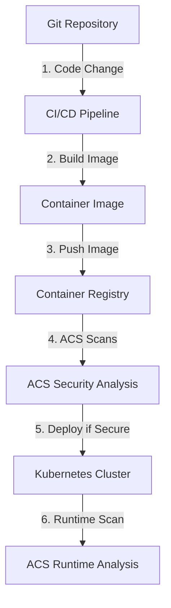

Let me break down Vulnerability Management in ACS (Advanced Cluster Security) in detail:

1. Container Image & Package Scanning:
   - ACS automatically scans all container images in your registry and running in your clusters
   - Scanning occurs at multiple points:
     * During CI/CD pipeline builds
     * When images are pushed to registries
     * Before deployment to clusters
     * While containers are running in production
   
   - The scanner checks for:
     * Known CVEs (Common Vulnerabilities and Exposures)
     * Out-of-date packages and libraries
     * Malware
     * Base image vulnerabilities
     * Configuration issues (like running as root)
     * Exposed secrets or sensitive data

2. Risk Scoring and Prioritization:
   - Each vulnerability is assigned a risk score based on:
     * CVSS (Common Vulnerability Scoring System) score
     * Exposure level (is the container internet-facing?)
     * Exploit availability
     * Fix availability
     * Asset importance
   
   - Prioritization features include:
     * Risk-based vulnerability grouping
     * Environment context (dev/staging/prod)
     * Deployment frequency
     * Custom risk factors you can define
     * Business criticality of the application

3. CI/CD Pipeline Integration:
   - Integrates with common CI/CD tools:
     * Jenkins
     * GitLab
     * GitHub Actions
     * Azure DevOps
     * CircleCI
   
   - Pipeline features:
     * Automated scanning during builds
     * Policy enforcement gates
     * Break-the-build capabilities for critical vulnerabilities
     * Automated fix recommendations
     * Vulnerability reports in pipeline outputs
   
   - Policy enforcement options:
     * Block deployments based on severity
     * Enforce base image requirements
     * Require vulnerability fixes within specific timeframes
     * Custom policy creation based on your security requirements

4. Additional Vulnerability Management Features:
   - Time-to-live (TTL) enforcement for images
   - Automatic generation of Software Bill of Materials (SBOM)
   - Integration with external vulnerability databases
   - Custom vulnerability exceptions and waivers
   - Automated ticketing system integration (Jira, ServiceNow)
   - Historical vulnerability tracking and trending
   - Compliance reporting for vulnerability management

5. Remediation Workflows:
   - Automated fix suggestions
   - Integration with patch management systems
   - Vulnerability notification systems
   - Custom remediation playbooks
   - Track fixes across environments
   - Automated retesting after fixes

6. Real-world Usage Example:
   ```plaintext
   Scenario: New critical vulnerability discovered
   
   1. ACS detects CVE in running container
   2. Risk score calculated based on exposure
   3. Notification sent to security team
   4. CI/CD pipeline blocks new deployments
   5. Fix verified in development
   6. Automated deployment of fixed version
   7. Verification scan confirms resolution
   ```

Would you like me to elaborate on any specific aspect of these vulnerability management features or explain how to implement them in your environment?

---------------------

Elaboration on 'Scenario: New critical vulnerability discovered':
Let me break down this scenario step by step in detail:

1. ACS Detects CVE in Running Container:
   - ACS continuously scans running containers in your cluster
   - Detection methods include:
     * Runtime scanning of container contents
     * Memory scanning for known signatures
     * Package manifest analysis
     * Base image verification
   - When detected, ACS immediately:
     * Logs the finding
     * Creates an incident record
     * Initiates the response workflow
     * Records container metadata (image, repository, running locations)

2. Risk Score Calculation Based on Exposure:
   - ACS evaluates multiple factors:
     * CVSS base score of the vulnerability
     * Container exposure level:
       - Internet-facing services (highest risk)
       - Internal services
       - Batch jobs (lower risk)
     * Container privileges:
       - Root access
       - Host mount points
       - Security context
     * Data sensitivity:
       - PII handling
       - Financial data
       - Healthcare information
     * Deployment environment:
       - Production (highest risk)
       - Staging
       - Development (lower risk)

3. Notification Sent to Security Team:
   - Notification channels can include:
     * Email alerts
     * Slack/Teams messages
     * JIRA tickets
     * ServiceNow incidents
     * Custom webhooks
   - Notification contains:
     * CVE details and description
     * Affected containers and locations
     * Risk score and severity
     * Recommended remediation steps
     * Link to ACS dashboard for details

4. CI/CD Pipeline Blocks New Deployments:
   - ACS automatically:
     * Updates deployment policies
     * Blocks new deployments with same vulnerability
     * Prevents image promotions to higher environments
   - Pipeline actions:
     * Fails builds using affected base images
     * Notifies developers with details
     * Creates tickets for tracking
     * Logs policy violations

5. Fix Verified in Development:
   - Development team process:
     * Updates base images or packages
     * Patches vulnerable components
     * Updates dependencies
   - ACS verifies:
     * New image builds
     * Security compliance
     * Policy adherence
     * No new vulnerabilities introduced

6. Automated Deployment of Fixed Version:
   - Deployment process:
     * CI/CD pipeline builds new image
     * ACS performs pre-deployment scan
     * Verification of policy compliance
     * Rolling update to replace vulnerable containers
   - Deployment options:
     * Canary deployment
     * Blue-green deployment
     * Rolling updates
     * Immediate replacement

7. Verification Scan Confirms Resolution:
   - Post-deployment checks:
     * Full container scan
     * Runtime security verification
     * Network policy compliance
     * Configuration validation
   - Final steps:
     * Update incident status
     * Generate compliance reports
     * Document resolution
     * Update security posture metrics

Example Timeline:
```plaintext
T+0min:  CVE detected in running container
T+1min:  Risk score calculated (8.9/10 - Critical)
T+2min:  Security team notified via Slack and JIRA
T+3min:  CI/CD pipelines updated with block policy
T+30min: Development team patches vulnerability
T+45min: New image built and verified
T+60min: Automated deployment begins
T+75min: All containers updated and verified
T+80min: Incident closed with full documentation
```

Would you like me to elaborate on any specific step or explain how to configure ACS for any of these processes?

Elaboration on each of the above processes:
I'll break down each part of the process in extensive detail.

1. DETECTION PROCESS:
```plaintext
A. Continuous Scanning
   - Runtime container scanning every 4-8 hours (configurable)
   - Real-time monitoring of container behavior
   - System calls analysis
   - Network traffic monitoring
   - File system changes tracking

B. Detection Methods
   - Signature-based detection
   - Behavioral analysis
   - Configuration assessment
   - Package manifest validation
   - Binary analysis
   - Layer-by-layer image inspection

C. Initial Response
   - Incident creation in ACS database
   - Timestamp and initial categorization
   - Affected component isolation
   - Preliminary impact assessment
   - Automated evidence collection
```

2. RISK SCORING PROCESS:
```plaintext
A. CVSS Score Analysis
   - Base score evaluation
   - Temporal score calculation
   - Environmental score adjustment
   - Attack vector assessment
   - Impact potential measurement

B. Exposure Assessment
   - Network exposure level
     * Internet-facing (High Risk)
     * Internal network (Medium Risk)
     * Isolated network (Low Risk)
   - Service accessibility
     * Public endpoints
     * Load balancer configuration
     * Ingress rules
     * Service mesh policies

C. Container Context
   - Privileges assessment
     * Root access
     * Capabilities
     * Security contexts
   - Volume mounts
   - Resource access
   - Service account permissions

D. Data Classification
   - PII handling status
   - Regulatory compliance requirements
   - Business criticality
   - Data sensitivity levels
```

3. NOTIFICATION SYSTEM:
```plaintext
A. Alert Configuration
   - Channel setup
     * Email templates
     * Slack workspace integration
     * MS Teams webhook configuration
     * JIRA project mapping
     * ServiceNow instance connection

B. Notification Content
   - Incident summary
   - Technical details
     * CVE identifier
     * CVSS score
     * Affected packages
     * Vulnerability description
   - Impact assessment
   - Recommended actions
   - Reference links
   - Escalation path

C. Escalation Rules
   - Severity-based routing
   - Time-based escalation
   - Team availability checking
   - On-call rotation integration
```

4. CI/CD PIPELINE BLOCKING:
```plaintext
A. Policy Enforcement
   - Policy creation
     * Vulnerability thresholds
     * Environment-specific rules
     * Compliance requirements
   - Block rules configuration
   - Exception handling
   - Override procedures

B. Pipeline Integration
   - Jenkins pipeline configuration
   ```groovy
   stage('Security Scan') {
     steps {
       script {
         def scanResult = acsImageScan(
           image: "${IMAGE_NAME}:${IMAGE_TAG}",
           failOnCritical: true,
           timeout: 300
         )
         if (scanResult.criticalVulnerabilities > 0) {
           error "Critical vulnerabilities found"
         }
       }
     }
   }
   ```

C. Developer Notification
   - Build failure notifications
   - Vulnerability reports
   - Fix recommendations
   - Documentation links
```

5. DEVELOPMENT VERIFICATION:
```plaintext
A. Fix Implementation
   - Package updates
   - Configuration changes
   - Code modifications
   - Dependency updates

B. Testing Process
   - Local security testing
   - Integration testing
   - Compliance verification
   - Performance impact assessment

C. Validation Steps
   - Pre-commit hooks
   - Build-time checks
   - Policy compliance
   - Security baseline comparison
```

6. AUTOMATED DEPLOYMENT:
```plaintext
A. Deployment Strategy
   - Rolling update configuration
     ```yaml
     spec:
       strategy:
         type: RollingUpdate
         rollingUpdate:
           maxUnavailable: 25%
           maxSurge: 25%
     ```
   - Canary deployment setup
   - Blue-green deployment configuration
   - Rollback procedures

B. Deployment Verification
   - Health checks
   - Security posture verification
   - Performance monitoring
   - Compliance validation

C. Automation Scripts
   - Deployment automation
   - Validation checks
   - Rollback triggers
   - Monitoring integration
```

7. VERIFICATION SCANNING:
```plaintext
A. Post-Deployment Checks
   - Full security scan
   - Configuration validation
   - Network policy verification
   - Runtime behavior analysis

B. Documentation
   - Incident closure
   - Resolution details
   - Lessons learned
   - Process improvements

C. Compliance Reporting
   - Audit trail generation
   - Compliance status updates
   - Risk posture assessment
   - Metrics collection
```

Would you like me to:
1. Provide specific configuration examples for any of these components?
2. Explain how to customize these processes for your environment?
3. Detail the integration points with other security tools?
4. Show examples of custom policies or rules?

I'll break down each of those additional aspects, starting with specific configurations and implementations.

1. SPECIFIC CONFIGURATION EXAMPLES:

A. ACS Central Installation
```yaml
apiVersion: platform.stackrox.io/v1alpha1
kind: Central
metadata:
  name: stackrox-central-services
  namespace: stackrox
spec:
  central:
    exposure:
      loadBalancer:
        enabled: false
        port: 443
      nodePort:
        enabled: true
        port: 30443
    persistence:
      persistentVolumeClaim:
        claimName: stackrox-db
        size: 100Gi
  egress:
    connectivityPolicy: Online
```

B. Sensor Configuration
```yaml
apiVersion: platform.stackrox.io/v1alpha1
kind: Sensor
metadata:
  name: stackrox-sensor
  namespace: stackrox
spec:
  auditLogs:
    collection: Dynamic
  clusterName: production-cluster
  admissionControl:
    listenOnUpdates: true
    enforceOnUpdates: true
    timeoutSeconds: 3
```

C. Custom Security Policy
```yaml
apiVersion: platform.stackrox.io/v1alpha1
kind: Policy
metadata:
  name: critical-vulnerability-policy
  namespace: stackrox
spec:
  criteria:
    - category: Vulnerability Management
      field: CVE Severity
      op: IN
      values: ["CRITICAL"]
  actions:
    - action: FAIL_BUILD_ENFORCEMENT
    - action: SCALE_TO_ZERO_ENFORCEMENT
    - action: ALERT
  notifiers:
    - slack
    - jira
```

2. INTEGRATION POINTS:

A. Jenkins Pipeline Integration:
```groovy
pipeline {
    agent any
    environment {
        ROX_API_TOKEN = credentials('stackrox-api-token')
        IMAGE_NAME = 'your-app'
        IMAGE_TAG = 'latest'
    }
    stages {
        stage('Security Scan') {
            steps {
                script {
                    // Scan image for vulnerabilities
                    sh """
                        roxctl image scan --token=${ROX_API_TOKEN} \
                        --name=${IMAGE_NAME} \
                        --tag=${IMAGE_TAG} \
                        --output=json > scan_results.json
                    """
                    
                    // Parse results and fail on critical findings
                    def scanResults = readJSON file: 'scan_results.json'
                    if (scanResults.criticalVulnerabilities > 0) {
                        error "Critical vulnerabilities found"
                    }
                }
            }
        }
    }
}
```

B. Kubernetes Admission Controller:
```yaml
apiVersion: admission.stackrox.io/v1alpha1
kind: AdmissionControl
metadata:
  name: admission-control
spec:
  dynamicConfig:
    enabled: true
  listenOnMutations: true
  listenOnCreates: true
  listenOnUpdates: true
  timeoutSeconds: 3
  enforceOnMutations: true
  enforceOnCreates: true
  enforceOnUpdates: true
  scanInline: true
```

C. JIRA Integration Configuration:
```yaml
apiVersion: platform.stackrox.io/v1alpha1
kind: Integration
metadata:
  name: jira-integration
spec:
  type: jira
  jira:
    url: "https://your-jira-instance.com"
    username: "jira-service-account"
    password: "${JIRA_TOKEN}"
    project: "SEC"
    issueType: "Security Issue"
    priority: "High"
    assignee: "security-team"
    labels: ["security", "container-vulnerability"]
```

3. CUSTOM POLICIES AND RULES:

A. Network Segmentation Policy:
```yaml
apiVersion: platform.stackrox.io/v1alpha1
kind: NetworkPolicy
metadata:
  name: strict-network-policy
spec:
  criteria:
    - category: Network Graph
      field: Exposure Level
      op: IN
      values: ["External", "Internet-facing"]
  restrictions:
    - port: "443"
      protocol: TCP
      cidr: "10.0.0.0/8"
    - port: "80"
      protocol: TCP
      cidr: "10.0.0.0/8"
  actions:
    - action: ALERT_AND_ENFORCE
```

B. Runtime Security Policy:
```yaml
apiVersion: platform.stackrox.io/v1alpha1
kind: RuntimePolicy
metadata:
  name: runtime-security
spec:
  behaviors:
    - name: "Suspicious Process Execution"
      processes: ["nc", "netcat", "nmap"]
      action: KILL_POD
    - name: "Sensitive File Access"
      paths: ["/etc/shadow", "/etc/passwd"]
      action: ALERT
  actions:
    - action: KILL_POD_ENFORCEMENT
    - action: ALERT
```

4. MONITORING AND ALERTING:

A. Prometheus Metrics Configuration:
```yaml
apiVersion: monitoring.coreos.com/v1
kind: ServiceMonitor
metadata:
  name: stackrox-monitor
  namespace: stackrox
spec:
  endpoints:
  - port: metrics
    interval: 30s
    path: /metrics
  selector:
    matchLabels:
      app: stackrox
```

B. Alert Manager Rules:
```yaml
apiVersion: monitoring.coreos.com/v1
kind: PrometheusRule
metadata:
  name: stackrox-alerts
spec:
  groups:
  - name: StackRox
    rules:
    - alert: HighSeverityVulnerability
      expr: stackrox_vulnerability_findings{severity="CRITICAL"} > 0
      for: 5m
      labels:
        severity: critical
      annotations:
        description: "Critical vulnerability detected in {{ $labels.namespace }}"
```

Would you like me to:
1. Provide detailed explanation of any of these configurations?
2. Show examples of response playbooks for specific scenarios?
3. Explain the metrics and monitoring capabilities in more detail?
4. Demonstrate how to customize these for specific compliance requirements? 

I'll continue with detailed explanations for each component and additional advanced configurations.

1. RESPONSE PLAYBOOKS AND SCENARIOS:

A. Critical Vulnerability Response Playbook
```yaml
apiVersion: v1alpha1
kind: SecurityPlaybook
metadata:
  name: critical-cve-response
spec:
  triggers:
    - type: Vulnerability
      severity: Critical
      score: ">= 9.0"
  
  automatedActions:
    - name: "Immediate Container Isolation"
      action:
        type: NetworkIsolation
        params:
          mode: strict
          allowInternalDNS: true
    
    - name: "Evidence Collection"
      action:
        type: ForensicsCollection
        params:
          captureProcessList: true
          captureNetworkConnections: true
          captureLogs: true
          retentionPeriod: 30d
    
    - name: "Incident Creation"
      action:
        type: CreateIncident
        params:
          system: JIRA
          template: critical-vulnerability
          assignee: security-team
          priority: P1
```

B. Runtime Anomaly Detection Configuration:
```yaml
apiVersion: platform.stackrox.io/v1alpha1
kind: RuntimeDetection
metadata:
  name: advanced-runtime-monitoring
spec:
  processMonitoring:
    enabled: true
    rules:
      - name: "Suspicious Binary Execution"
        match:
          executable:
            - "/bin/bash"
            - "/usr/bin/curl"
            - "/usr/bin/wget"
          parent: "nginx"
        severity: High
        action: KILL_PROCESS

  fileSystemMonitoring:
    enabled: true
    rules:
      - name: "Sensitive File Access"
        paths:
          - "/etc/shadow"
          - "/etc/passwd"
          - "/var/run/secrets"
        operations:
          - WRITE
          - READ
        severity: Critical
        action: ALERT

  networkMonitoring:
    enabled: true
    rules:
      - name: "Unusual Outbound Connection"
        match:
          destination:
            - "0.0.0.0/0"
          port:
            - "22"
            - "3306"
        severity: High
        action: BLOCK_NETWORK
```

2. DETAILED METRICS AND MONITORING:

A. Advanced Prometheus Metrics Configuration:
```yaml
apiVersion: monitoring.coreos.com/v1
kind: PodMonitor
metadata:
  name: acs-detailed-monitoring
spec:
  selector:
    matchLabels:
      app: stackrox-sensor
  podMetricsEndpoints:
    - port: metrics
      interval: 15s
      metricRelabelings:
        - sourceLabels: [__name__]
          regex: 'container_(memory|cpu)_.*'
          action: keep
  namespaceSelector:
    matchNames:
      - stackrox
```

B. Grafana Dashboard Configuration:
```json
{
  "dashboard": {
    "id": null,
    "title": "ACS Security Overview",
    "panels": [
      {
        "title": "Critical Vulnerabilities Over Time",
        "type": "graph",
        "datasource": "Prometheus",
        "targets": [
          {
            "expr": "sum(stackrox_vulnerability_findings{severity='CRITICAL'}) by (namespace)",
            "legendFormat": "{{namespace}}"
          }
        ]
      },
      {
        "title": "Policy Violations",
        "type": "stat",
        "datasource": "Prometheus",
        "targets": [
          {
            "expr": "sum(stackrox_policy_violations_total)"
          }
        ]
      }
    ]
  }
}
```

3. COMPLIANCE AUTOMATION:

A. PCI Compliance Policy Set:
```yaml
apiVersion: platform.stackrox.io/v1alpha1
kind: CompliancePolicy
metadata:
  name: pci-dss-controls
spec:
  standards:
    - name: PCI-DSS
      version: "3.2.1"
      controls:
        - id: "2.2"
          checks:
            - type: "configuration"
              criteria:
                - field: "Container Runtime"
                  op: "NOT_EQUALS"
                  value: "privileged"
        
        - id: "7.1"
          checks:
            - type: "rbac"
              criteria:
                - field: "ServiceAccount"
                  op: "HAS_ROLES"
                  values: ["limited-access"]

  enforcement:
    onFailure: BLOCK_DEPLOYMENT
    exceptions:
      namespaces: ["kube-system"]
```

B. HIPAA Security Configuration:
```yaml
apiVersion: platform.stackrox.io/v1alpha1
kind: SecurityConfig
metadata:
  name: hipaa-security-controls
spec:
  encryption:
    required: true
    minimumStrength: AES256
  
  networkPolicies:
    enforced: true
    defaultDeny: true
  
  audit:
    level: RequestResponse
    retention: 180d
  
  authentication:
    mfa: required
    sessionTimeout: 15m
  
  dataClassification:
    enabled: true
    patterns:
      - type: "PHI"
        regex: "\\b\\d{3}-\\d{2}-\\d{4}\\b"
        action: ALERT
```

4. INTEGRATION WITH CI/CD SYSTEMS:

A. GitHub Actions Integration:
```yaml
name: ACS Security Scan
on:
  push:
    branches: [ main ]
  pull_request:
    branches: [ main ]

jobs:
  security-scan:
    runs-on: ubuntu-latest
    steps:
      - uses: actions/checkout@v2
      
      - name: Run ACS Scan
        uses: stackrox/acs-scanner-action@v1
        with:
          api-token: ${{ secrets.ROX_API_TOKEN }}
          central-endpoint: ${{ secrets.ROX_CENTRAL_ENDPOINT }}
          image: ${{ github.repository }}:${{ github.sha }}
          fail-on: CRITICAL

      - name: Upload Results
        if: always()
        uses: actions/upload-artifact@v2
        with:
          name: security-scan-results
          path: scan-results.json
```

Would you like me to:
1. Provide examples of custom response automation?
2. Show more detailed compliance configurations?
3. Explain the integration with other security tools?
4. Demonstrate advanced monitoring and alerting setups?

I'll continue with more advanced configurations and detailed explanations.

1. CUSTOM RESPONSE AUTOMATION:

A. Advanced Incident Response Workflow:
```yaml
apiVersion: platform.stackrox.io/v1alpha1
kind: ResponseAutomation
metadata:
  name: advanced-incident-response
spec:
  triggers:
    - type: SecurityEvent
      conditions:
        severity: High
        category: ["Runtime", "Vulnerability"]
        impact: Critical

  phases:
    - name: "Initial Response"
      actions:
        - type: ContainerIsolation
          params:
            mode: NetworkIsolate
            preserveLogging: true
        
        - type: SnapshotCreation
          params:
            type: "Full"
            includeMemory: true
            timeout: 300s

    - name: "Evidence Collection"
      actions:
        - type: ForensicsCapture
          params:
            captureTypes:
              - ProcessList
              - NetworkConnections
              - FileSystemChanges
              - SystemCalls
            destination: "s3://security-forensics/"
            retention: 90d

    - name: "Automated Analysis"
      actions:
        - type: ThreatAnalysis
          params:
            scanType: "Deep"
            yara: true
            behavioral: true
            iocMatching: true

    - name: "Remediation"
      actions:
        - type: AutoRemediation
          conditions:
            confidence: ">= 90%"
          params:
            actions:
              - ScaleToZero
              - BlockImage
              - QuarantineNode
```

2. ADVANCED MONITORING AND METRICS:

A. Detailed Prometheus Rules:
```yaml
apiVersion: monitoring.coreos.com/v1
kind: PrometheusRule
metadata:
  name: advanced-security-metrics
spec:
  groups:
  - name: SecurityMetrics
    rules:
    - record: security:vulnerability_ratio
      expr: |
        sum(stackrox_vulnerabilities{severity="CRITICAL"}) /
        sum(stackrox_vulnerabilities{})
    
    - record: security:compliance_score
      expr: |
        (sum(stackrox_compliance_checks{status="PASS"}) /
        sum(stackrox_compliance_checks{})) * 100
    
    - alert: AnomalousContainerActivity
      expr: |
        rate(stackrox_container_terminations_abnormal[5m]) > 
        (avg_over_time(stackrox_container_terminations_abnormal[6h]) * 2)
      for: 5m
      labels:
        severity: warning
      annotations:
        description: "Abnormal container termination rate detected"

    - alert: ComplianceDrift
      expr: |
        delta(security:compliance_score[1h]) < -5
      for: 15m
      labels:
        severity: critical
      annotations:
        description: "Significant compliance score decrease detected"
```

B. Advanced Alerting Configuration:
```yaml
apiVersion: monitoring.coreos.com/v1
kind: AlertmanagerConfig
metadata:
  name: security-alerts
spec:
  route:
    receiver: 'security-team'
    group_by: ['alertname', 'cluster', 'severity']
    group_wait: 30s
    group_interval: 5m
    repeat_interval: 4h
    routes:
    - match:
        severity: critical
      receiver: 'security-team-pager'
      continue: true
    - match:
        severity: warning
      receiver: 'security-team-slack'

  receivers:
  - name: 'security-team-pager'
    pagerduty_configs:
    - service_key: '<secret>'
      severity: '{{ .GroupLabels.severity }}'
      description: '{{ .GroupLabels.alertname }}'
      client: 'ACS Monitoring'
      client_url: '{{ .ExternalURL }}'
      
  - name: 'security-team-slack'
    slack_configs:
    - api_url: '<webhook-url>'
      channel: '#security-alerts'
      text: "{{ range .Alerts }}{{ .Annotations.description }}\n{{ end }}"
```

3. ADVANCED COMPLIANCE CONFIGURATIONS:

A. Multi-Standard Compliance Framework:
```yaml
apiVersion: platform.stackrox.io/v1alpha1
kind: ComplianceFramework
metadata:
  name: multi-standard-compliance
spec:
  standards:
    - name: "PCI-DSS"
      version: "3.2.1"
      controls:
        - id: "1.1"
          implementations:
            - type: NetworkPolicy
              spec:
                ingress:
                  defaultDeny: true
            - type: PodSecurityPolicy
              spec:
                privileged: false
                
    - name: "HIPAA"
      controls:
        - id: "164.312"
          implementations:
            - type: EncryptionPolicy
              spec:
                minStrength: AES256
            - type: AccessControl
              spec:
                requireMFA: true
                
    - name: "SOC2"
      controls:
        - id: "CC6.1"
          implementations:
            - type: AuditPolicy
              spec:
                level: RequestResponse
                retention: 365d

  enforcement:
    mode: EnforceWithExceptions
    exceptions:
      namespaces:
        - kube-system
      labels:
        compliance-exempt: "true"
```

4. ADVANCED INTEGRATION CONFIGURATIONS:

A. GitOps Security Pipeline:
```yaml
apiVersion: platform.stackrox.io/v1alpha1
kind: SecurityPipeline
metadata:
  name: gitops-security
spec:
  source:
    git:
      url: "https://github.com/org/repo"
      branch: main
      path: /k8s
      
  scanning:
    preDeployment:
      - name: "Vulnerability Scan"
        type: ImageScan
        criteria:
          maxCritical: 0
          maxHigh: 3
          
      - name: "Configuration Check"
        type: ConfigAudit
        criteria:
          requiredLabels: true
          resourceLimits: true
          
      - name: "Secret Detection"
        type: SecretScan
        criteria:
          allowedPatterns:
            - type: "API Key"
              pattern: "^[A-Za-z0-9]{32}$"
              
  deployment:
    strategy:
      type: Progressive
      stages:
        - name: dev
          validation:
            duration: 1h
        - name: staging
          validation:
            duration: 24h
        - name: production
          approval:
            required: true
            approvers: ["security-team"]
```

Would you like me to:
1. Show more advanced security automation examples?
2. Provide detailed incident response workflows?
3. Explain advanced network security configurations?
4. Demonstrate additional compliance frameworks?

I'll continue with more advanced security configurations and automation examples.

1. ADVANCED SECURITY AUTOMATION:

A. Zero-Trust Security Framework:
```yaml
apiVersion: platform.stackrox.io/v1alpha1
kind: ZeroTrustPolicy
metadata:
  name: comprehensive-zero-trust
spec:
  networkPolicies:
    defaultDeny: true
    allowedConnections:
      - source:
          namespaceLabels:
            tier: frontend
        destination:
          namespaceLabels:
            tier: backend
          ports: [8080]
          
  identityVerification:
    mutualTLS:
      required: true
      minVersion: "TLS1.3"
    serviceAccounts:
      autoRotation: true
      tokenLifetime: 24h
      
  accessControl:
    authentication:
      methods:
        - type: OIDC
          provider: "okta"
          groups: ["security-admins", "developers"]
        - type: certificateAuth
          validator: spiffe
    
    authorization:
      defaultDeny: true
      rules:
        - name: "Admin Access"
          subjects: ["security-admins"]
          resources: ["*"]
          verbs: ["*"]
        
        - name: "Developer Access"
          subjects: ["developers"]
          resources: ["deployments", "pods"]
          verbs: ["get", "list"]
```

B. Advanced Runtime Protection:
```yaml
apiVersion: platform.stackrox.io/v1alpha1
kind: RuntimeProtection
metadata:
  name: advanced-runtime-security
spec:
  processControl:
    defaultMode: Monitor
    rules:
      - name: "Crypto Mining Detection"
        match:
          processes: ["cryptominer", "xmrig"]
          commandLine: ["*pool.mining*", "*crypto*"]
        action: Kill
        alert:
          severity: Critical
          
      - name: "Reverse Shell Detection"
        match:
          networkConnections:
            direction: Outbound
            destinations: ["*"]
            ports: [4444, 5555]
          processes: ["bash", "nc", "python"]
        action: Block
        
  fileSystemProtection:
    sensitiveDirectories:
      - path: "/etc"
        permissions: ReadOnly
      - path: "/var/run/secrets"
        permissions: NoAccess
        
    integrityMonitoring:
      enabled: true
      paths:
        - "/usr/bin"
        - "/usr/sbin"
      exclusions:
        - "/var/log"
        - "/tmp"
```

2. INCIDENT RESPONSE WORKFLOWS:

A. Advanced Incident Response Automation:
```yaml
apiVersion: platform.stackrox.io/v1alpha1
kind: IncidentResponse
metadata:
  name: comprehensive-ir-plan
spec:
  triggers:
    - type: Vulnerability
      severity: Critical
    - type: Compliance
      status: Failed
    - type: Runtime
      category: ["Exploitation", "Backdoor"]

  responseStages:
    - name: "Initial Triage"
      automated: true
      actions:
        - type: PodIsolation
          params:
            networkPolicy: restrict-all
            duration: 1h
        - type: Evidence
          params:
            collectLogs: true
            snapshotContainer: true
            
    - name: "Investigation"
      automated: false
      requiredActions:
        - type: ForensicsCollection
          params:
            memory: true
            filesystem: true
            network: true
        - type: ThreatHunting
          params:
            scope: cluster
            depth: comprehensive
            
    - name: "Containment"
      approval:
        required: true
        groups: ["security-incident-response"]
      actions:
        - type: BlockImage
          scope: global
        - type: QuarantineNode
          duration: unlimited

    - name: "Eradication"
      actions:
        - type: RemoveCompromised
          params:
            removeSecrets: true
            purgeImages: true
        - type: UpdateBaseline
          params:
            updateSecurityControls: true
```

3. ADVANCED NETWORK SECURITY:

A. Dynamic Network Segmentation:
```yaml
apiVersion: platform.stackrox.io/v1alpha1
kind: NetworkSegmentation
metadata:
  name: dynamic-network-controls
spec:
  baselineLearning:
    enabled: true
    duration: 7d
    minimumConfidence: 95
    
  automaticPolicies:
    enabled: true
    updateFrequency: 1h
    
  segmentationRules:
    - name: "Database Tier"
      match:
        podLabels:
          tier: database
      ingress:
        - from:
            namespaceLabels:
              tier: application
          ports:
            - protocol: TCP
              port: 5432
              
    - name: "Application Tier"
      match:
        podLabels:
          tier: application
      ingress:
        - from:
            namespaceLabels:
              tier: frontend
          ports:
            - protocol: TCP
              port: 8080
              
  anomalyDetection:
    enabled: true
    sensitivity: High
    actions:
      - alert
      - block
```

4. ADVANCED COMPLIANCE FRAMEWORKS:

A. Custom Compliance Framework:
```yaml
apiVersion: platform.stackrox.io/v1alpha1
kind: ComplianceFramework
metadata:
  name: custom-security-framework
spec:
  controls:
    - id: "SEC-1"
      name: "Container Hardening"
      checks:
        - type: ImageScan
          criteria:
            maxCriticalVulnerabilities: 0
            maxHighVulnerabilities: 3
            
        - type: Configuration
          criteria:
            readOnlyRootFilesystem: true
            runAsNonRoot: true
            privileged: false
            
    - id: "SEC-2"
      name: "Network Security"
      checks:
        - type: NetworkPolicy
          criteria:
            defaultDeny: true
            allowedConnections:
              documented: true
              
        - type: ServiceMesh
          criteria:
            mTLSEnabled: true
            
    - id: "SEC-3"
      name: "Access Control"
      checks:
        - type: RBAC
          criteria:
            leastPrivilege: true
            serviceAccountRotation: true
            
        - type: Secrets
          criteria:
            encrypted: true
            rotated: true
```

Would you like me to:
1. Show more advanced threat detection configurations?
2. Provide detailed security monitoring setups?
3. Explain advanced container security policies?
4. Demonstrate additional automation workflows?

I'll break down the relationship between container registries, Git repositories, and how ACS interacts with them in detail.

1. CONTAINER REGISTRY VS GIT REPOSITORY:

A. Container Registry:
- Purpose: Stores built container images
- Examples: 
  * Docker Hub
  * Amazon Elastic Container Registry (ECR)
  * Google Container Registry (GCR)
  * Azure Container Registry (ACR)
  * Red Hat Quay

```plaintext
Registry Structure Example:
registry.example.com/
├── project/
│   ├── app:1.0.0
│   ├── app:1.0.1
│   └── app:latest
└── base-images/
    ├── nginx:1.21
    └── python:3.9
```

B. Git Repository:
- Purpose: Stores source code and configuration
- Examples:
  * GitHub
  * GitLab
  * Bitbucket

```plaintext
Git Repository Structure Example:
my-application/
├── src/
│   └── app.py
├── tests/
│   └── test_app.py
├── Dockerfile
└── kubernetes/
    └── deployment.yaml
```

2. INTERACTION FLOW:



3. DETAILED SCANNING PROCESS:

A. Registry Scanning Configuration:
```yaml
apiVersion: platform.stackrox.io/v1alpha1
kind: ImageIntegration
metadata:
  name: registry-scanning
spec:
  registries:
    - name: "production-registry"
      type: "docker"
      endpoint: "registry.example.com"
      credentials:
        username: "${REGISTRY_USER}"
        password: "${REGISTRY_PASSWORD}"
      
    - name: "development-registry"
      type: "ecr"
      region: "us-west-2"
      credentials:
        aws:
          roleArn: "arn:aws:iam::account:role/registry-scanner"

  scanSettings:
    schedule: "*/30 * * * *"  # Every 30 minutes
    concurrentScans: 5
    retentionPeriod: 30d
    
  notifications:
    - type: "slack"
      channel: "#security-alerts"
      events: ["NEW_CRITICAL_CVE"]
```

4. CI/CD INTEGRATION:

A. Jenkins Pipeline Example:
```groovy
pipeline {
    agent any
    environment {
        DOCKER_REGISTRY = 'registry.example.com'
        GIT_REPO = 'git@github.com:org/app.git'
        ACS_API_TOKEN = credentials('acs-api-token')
    }
    
    stages {
        stage('Checkout') {
            steps {
                git branch: 'main', url: "${GIT_REPO}"
            }
        }
        
        stage('Build Image') {
            steps {
                script {
                    docker.build("${DOCKER_REGISTRY}/app:${BUILD_NUMBER}")
                }
            }
        }
        
        stage('Security Scan') {
            steps {
                script {
                    // ACS Pre-deployment scan
                    sh """
                        roxctl image scan \
                        --endpoint="${ACS_CENTRAL}" \
                        --image="${DOCKER_REGISTRY}/app:${BUILD_NUMBER}" \
                        --output=json > scan_results.json
                    """
                    
                    // Parse results
                    def scanResults = readJSON file: 'scan_results.json'
                    if (scanResults.criticalVulnerabilities > 0) {
                        error "Critical vulnerabilities found"
                    }
                }
            }
        }
        
        stage('Push to Registry') {
            steps {
                script {
                    docker.withRegistry("https://${DOCKER_REGISTRY}", 'registry-credentials') {
                        docker.image("${DOCKER_REGISTRY}/app:${BUILD_NUMBER}").push()
                    }
                }
            }
        }
    }
}
```

5. CONTINUOUS MONITORING:

A. Registry Monitoring Configuration:
```yaml
apiVersion: platform.stackrox.io/v1alpha1
kind: ImageMonitoring
metadata:
  name: registry-monitoring
spec:
  watchPatterns:
    - registry: "registry.example.com"
      repositories:
        - "project/*"
        - "base-images/*"
      tags:
        - "latest"
        - "prod-*"
        
  vulnerabilityThresholds:
    critical: 0
    high: 3
    medium: 5
    
  actions:
    onViolation:
      - type: ALERT
        severity: High
      - type: BLOCK_DEPLOYMENT
        conditions:
          criticalVulnerabilities: true
          
  notifications:
    slack:
      channel: "#security-alerts"
      events:
        - NEW_VULNERABILITY
        - POLICY_VIOLATION
```
Would you like me to:
1. Provide more details about specific components?
2. Explain the relationship between open source and commercial parts?
3. Show examples of how to use the public repositories?
4. Detail the contribution process?

Yes, there are public repositories related to Red Hat Advanced Cluster Security (formerly StackRox). However, it's important to note that not all components are open source.

Here are the key repositories:

1. Main Repository (RHACS Operator):
```plaintext
https://github.com/stackrox/stackrox
```

2. Secured Workflows Repository:
```plaintext
https://github.com/stackrox/secured-workflows
```

3. Kubernetes Collector:
```plaintext
https://github.com/stackrox/collector
```

4. StackRox Ecosystem:
```plaintext
https://github.com/stackrox-ecosystem
```

Key Points to Note:

1. Community Access:
- Some components remain proprietary
- Not all features available in commercial version are in public repos
- Documentation and examples are publicly available

2. Open Source Components Include:
- Kubernetes Operators
- Collectors and Sensors
- Integration examples
- Deployment templates
- Policy examples

3. Commercial vs Open Source:
```yaml
Components:
  OpenSource:
    - Basic Kubernetes Operators
    - Deployment Templates
    - Policy Examples
    - Integration Examples
    
  Commercial:
    - Central Management Console
    - Advanced Analytics Engine
    - Proprietary Scanning Engines
    - Enterprise Support
    - Advanced Features
```

4. Key Directories in Main Repo:
```plaintext
stackrox/
├── operator/
│   ├── bundle/
│   └── helm/
├── sensor/
│   └── kubernetes/
├── collector/
│   └── compliance/
└── docs/
    └── development/
```

Would you like me to:
1. Provide more details about specific components?
2. Explain the relationship between open source and commercial parts?
3. Show examples of how to use the public repositories?
4. Detail the contribution process?

